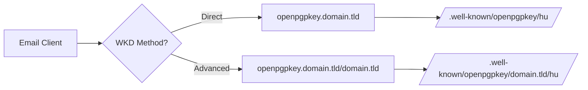

# 👋 Hi, I'm @nicfab

- 👀 I'm interested in AI, Privacy, Data Protection, Cybersecurity, and computer science.
- 🌱 I would like to spend more time learning what interests me... and it's so much stuff...

***

| | |
|:--: |:--: |
| 🧑🏼‍💼 To know something about me: | 🧑🏼‍💼 Qualcosa su di me: |
| **EN** [About me](https://notes.nicfab.eu/en/pages/about/) | **IT** [Chi sono](https://notes.nicfab.eu/it/pages/about/) |

***

# 📫 How to reach me and see my social profiles:
  
  - **EN**:
    - [**links**](https://links.nicfab.eu)
    - [**How to contact me**](https://notes.nicfab.eu/en/pages/about/#how-to-contact-me)
  - **IT**:
    - [**links**](https://links.nicfab.eu)
    - [**Come contattarmi**](https://notes.nicfab.eu/it/pages/about/#come-contattarmi)

***

# 🔐 My Web Key Directory (WKD)

As I wrote in my article entitled "[_Digital identity: Web Key Directory as a possible solution_](https://notes.nicfab.eu/en/posts/wkd/)", I decided to set up my own **Web Key Directory (WKD)** to provide more security and to make it easier to identify the public keys of my email addresses. 

## 📚 What is WKD?

Web Key Directory is a **decentralized OpenPGP key discovery protocol** that enables automatic public key retrieval using just an email address. Unlike traditional keyservers:

- 🔒 **Domain-controlled**: Key owners maintain full control
- 🌐 **HTTPS-based**: Leverages existing web infrastructure  
- 🤖 **Automatic**: No manual key exchange required
- 🔐 **Privacy-preserving**: No central database of keys

## 🏗️ My Implementation

I'm running the **Advanced WKD method** across multiple domains with the following architecture:

### Technical Stack

```
┌─────────────────┐
│   Email Client  │
└────────┬────────┘
         │ WKD Request
         ▼
┌─────────────────┐
│  DNS Resolution │
└────────┬────────┘
         │ HTTPS
         ▼
┌─────────────────┐
│  Nginx Server   │
│  ├─ TLS 1.3     │
│  ├─ CORS Headers│
│  └─ HSTS        │
└────────┬────────┘
         │
         ▼
┌─────────────────┐
│ WKD Directory   │
│ .well-known/    │
│  └─openpgpkey/  │
│    └─domain/    │
│      ├─hu/      │
│      └─policy   │
└─────────────────┘
```

### Security Features

| Feature | Implementation | Purpose |
|---------|---------------|---------|
| **TLS 1.3** | ✅ Enforced | Modern encryption |
| **HSTS** | ✅ max-age=63072000 | Prevent downgrade attacks |
| **CORS** | ✅ Configured | Web tool compatibility |
| **CSP** | ✅ Restrictive | XSS protection |
| **X-Frame-Options** | ✅ DENY | Clickjacking prevention |

### Performance Optimizations

- **HTTP/2** enabled for multiplexing
- **Brotli compression** for reduced bandwidth
- **OCSP stapling** for faster TLS handshakes
- **Static file serving** with nginx caching

## 🔍 Verifying My WKD

### Online Verification Tools

Check my WKD implementation status:

| Tool | Provider | Features |
|------|----------|----------|
| [WKD Checker](https://miarecki.eu/tools/wkd-checker/) | Miarecki | Both methods |
| [DP42 Checker](https://wkd.dp42.dev/) | DP42 | Advanced debugging |

*Note: Metacode WKD Checker was discontinued on 1.05.2024*

### Command Line Verification

```bash
# Test WKD discovery
gpg --locate-external-keys "user at domain dot tld"

# Force WKD if disabled in config
gpg --auto-key-locate clear,wkd --locate-external-keys "user at domain dot tld"

# Debug WKD lookup
gpg --debug-level guru --locate-external-keys "user at domain dot tld" 2>&1 | grep wkd
```

## 🔑 Fetching My OpenPGP Keys

### Method 1: Automatic GPG Discovery

Replace placeholders with actual values:

```bash
# Standard fetch
gpg --locate-external-keys "nicola at myGitHubUsername dot eu"

# With explicit WKD
gpg --auto-key-locate clear,wkd --locate-external-keys "nicola at myGitHubUsername dot eu"
```

### Method 2: Direct HTTPS Download

Use the WKD checker tools to obtain the direct URL, then:

```bash
# Using curl with TLS 1.3
curl --tlsv1.3 -o publickey.asc "[URL-from-WKD-checker]"

# Using wget with security options
wget --secure-protocol=TLSv1_3 --max-redirect=0 -O publickey.asc "[URL-from-WKD-checker]"

# Verify the downloaded key
gpg --show-keys publickey.asc
```

### Method 3: GitHub Integration

```bash
# Direct from GitHub
curl https://github.com/nicfab.gpg | gpg --import

# Or using GitHub API
curl https://api.github.com/users/nicfab/gpg_keys | jq -r '.[0].raw_key' | gpg --import
```

## 📱 Client Compatibility

### Native WKD Support

| Client | Platform | Version | Auto-discovery |
|--------|----------|---------|----------------|
| **Thunderbird** | Cross-platform | 78+ | ✅ Automatic |
| **Evolution** | Linux | 3.36+ | ✅ Automatic |
| **KMail** | Linux/KDE | 5.2+ | ✅ Automatic |
| **Mutt** | Unix-like | 2.0+ | ✅ With GPG |
| **ProtonMail Bridge** | Desktop | 2.0+ | ✅ On send |
| **GPG Suite** | macOS | 2020.2+ | ✅ Full |
| **Gpg4win** | Windows | 3.1.12+ | ✅ Full |
| **Claws Mail** | Cross-platform | 3.17+ | ✅ With plugin |

### Mobile Support

- **K-9 Mail** (Android) - Via OpenKeychain
- **FairEmail** (Android) - Built-in support
- **Canary Mail** (iOS) - Premium feature

## 🛠️ Technical Deep Dive

### WKD Hash Generation

The WKD protocol uses z-base32 encoded SHA-1 hashes:

```python
# Python implementation example
import hashlib
import base64

def generate_wkd_hash(local_part):
    """Generate WKD hash from email local part"""
    # SHA-1 hash of the lowercase local part
    sha1 = hashlib.sha1(local_part.lower().encode()).digest()
    # Z-base32 encoding (simplified example)
    # Actual implementation requires proper z-base32
    return base64.b32encode(sha1).decode().lower()[:32]
```

### Advanced vs Direct Method



### DNS Requirements

```dns
; Advanced method (recommended)
openpgpkey.example.com. IN A     203.0.113.1
openpgpkey.example.com. IN AAAA  2001:db8::1

; Direct method alternative
_openpgpkey.example.com. IN TXT "v=wkd1"
```

### Nginx Configuration Snippet

```nginx
# WKD-specific location block
location /.well-known/openpgpkey/ {
    default_type "application/octet-stream";
    
    # Security headers
    add_header X-Content-Type-Options nosniff always;
    
    # CORS for web-based tools
    add_header 'Access-Control-Allow-Origin' '*' always;
    add_header 'Access-Control-Allow-Methods' 'GET, OPTIONS' always;
    
    # Cache control
    add_header Cache-Control "public, max-age=7200";
    
    # Disable directory listing
    autoindex off;
}
```

## 🔒 Security Considerations

### Threat Model

| Threat | Mitigation | Status |
|--------|------------|--------|
| **Key substitution** | HTTPS + HSTS | ✅ Protected |
| **Enumeration attacks** | Rate limiting | ⚠️ Consider implementing |
| **DNS hijacking** | DNSSEC | ⚠️ Domain-dependent |
| **Privacy leaks** | No logging of queries | ✅ Configured |
| **DDoS attacks** | CDN consideration | 📝 Future enhancement |

### Operational Security

- 🔑 **Key rotation**: Annual review recommended
- 📊 **Monitoring**: Log analysis for anomalies
- 🔄 **Backup**: Offline key backup mandatory
- 🛡️ **Signing keys**: Keep offline when possible

## 📈 Future Enhancements

- [ ] Implement rate limiting for enumeration protection
- [ ] Add DNSSEC for DNS integrity
- [ ] Consider CDN for global availability
- [ ] Automate key rotation workflow
- [ ] Add monitoring dashboard
- [ ] Implement backup WKD server

## 🎓 Learning Resources

### Specifications
- [Draft RFC: OpenPGP Web Key Directory](https://datatracker.ietf.org/doc/draft-koch-openpgp-webkey-service/)
- [GnuPG WKD Wiki](https://wiki.gnupg.org/WKD)
- [Keyoxide WKD Documentation](https://docs.keyoxide.org/wiki/web-key-directory/)

### Implementation Guides
- [My detailed article on WKD](https://notes.nicfab.eu/en/posts/wkd/)
- [WKD Hosting Best Practices](https://wiki.gnupg.org/WKDHosting)
- [Email Security with WKD](https://www.kuketz-blog.de/gnupg-web-key-directory-wkd-einrichten/)

### Related Technologies
- [OpenPGP](https://www.openpgp.org/) - The encryption standard
- [Autocrypt](https://autocrypt.org/) - Automated encryption
- [DANE](https://datatracker.ietf.org/doc/html/rfc7929) - DNS-based authentication

## 💡 Tips for Implementing Your Own WKD

1. **Start with Advanced method** - More flexible for subdomains
2. **Test locally first** - Use `python -m http.server` for testing
3. **Validate CORS headers** - Essential for web tools
4. **Monitor access logs** - Watch for enumeration attempts
5. **Document everything** - Future you will thank you

## 🤝 Contributing

Found an issue or have suggestions? Feel free to:
- Open an issue on my repositories
- Contact me through the links above
- Share your WKD implementation experiences

***

## 🙏 Credits

- [**duxsco**](https://github.com/duxsco) - For invaluable WKD implementation insights
- [**Jonatan Miarecki**](https://miarecki.eu/) - For maintaining the excellent WKD checker tool
- [**GnuPG Team**](https://gnupg.org/) - For creating and maintaining the WKD specification
- [**Keyoxide Project**](https://keyoxide.org/) - For promoting decentralized identity verification

***

## 📊 Stats


***

*🔄 Last updated: September 2025*  
*🛡️ Security: HTTPS-only with TLS 1.3*  
*🔑 Implementation: Advanced WKD method*  
*📧 Privacy: No direct email exposure*
